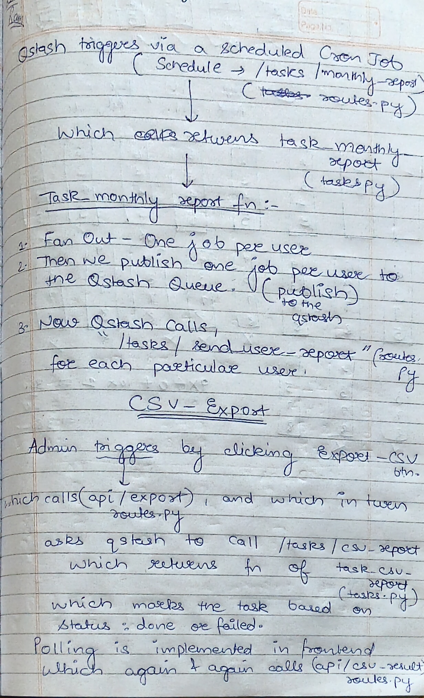

# 🚀 Vue2JS + Flask Async Application (WSL)

This project demonstrates a **Vue2JS + Flask** application with asynchronous background  
processing for tasks such as **monthly jobs** and **CSV exports**.

Originally designed using **Celery + Redis**, the production deployment leverages  
**Upstash QStash** to trigger background jobs in a more cost-efficient and scalable way.

---

## 🧰 Tech Stack

- **Frontend:** Vue2 (CDN-based)  
- **Backend:** Flask  
- **Queue (Original):** Celery + Redis  
- **Queue (Production):** Upstash QStash  
- **Environment:** WSL (Ubuntu)  
- **Language:** Python 3  

---

## 📌 Prerequisites
Ensure that you have the following installed:

* WSL with Ubuntu (Refer to the installation guide if needed)
* Python 3 and pip
* Redis
## ⚙️ Step 1: Create and Activate Virtual Environment
```
mkdir my_project && cd my_project
python3 -m venv venv
source venv/bin/activate
```
## 📦 Step 2: Install Dependencies
Navigate to the Flask backend directory and install dependencies:
```
cd backend  # Change to the backend directory
pip install -r requirements.txt
```
## 🔴 Step 3: Start Redis Server
Ensure Redis is installed and start the Redis server:
```
sudo service redis-server start
```
To check if Redis is running:
```
redis-cli ping  # Should return 'PONG'
```
## 🐝 Step 4: Start Celery Worker
```
cd backend  # Ensure you're in the backend directory
celery -A app.celery worker --loglevel=info
```
## ⏰ Step 5: Start Celery Beat
```
celery -A app.celery beat --loglevel=info
```
## 🚀 Step 6: Start Flask Application
```
python app.py
The Flask app should now be running.
```

## 🌐 Step 7: Load VueJS via CDN
Instead of using Vue CLI, the Vue application is loaded via CDN in an `index.html` file. Ensure your project structure includes:

Ensure this file is in the frontend directory and served properly.

## 🧪 Step 8: Testing the Setup
* Open your browser and navigate to the Flask backend API: http://localhost:5000
* Open index.html in a browser or serve it using a lightweight HTTP server (e.g., python -m http.server in the frontend directory).
* Monitor Celery logs to ensure background tasks are working correctly.
## 🛑 Stopping Services
To stop the services:
```
sudo servicectl stop redis  # Stop Redis
pkill -f "celery"  # Stop Celery worker and beat
```
## 🧠 Asynchronous Task Flow (QStash + Redis)

<p align="center">
  
</p>

Background tasks such as monthly jobs and CSV exports are processed asynchronously.

The system was initially built using Celery + Redis, but to reduce infrastructure costs
in production, it now uses Upstash QStash to reliably queue and trigger background jobs
in a serverless manner.

This approach provides:

- ✅ Better scalability

- ✅ Lower operational cost

- ✅ Non-blocking Flask requests

- ✅ Reliable task execution
## ✅ Conclusion
Following these steps will allow you to run the Vue2JS + Flask application locally within WSL.

For production workloads, the project leverages Upstash QStash to handle asynchronous
execution efficiently while avoiding the overhead of dedicated Celery worker infrastructure.


